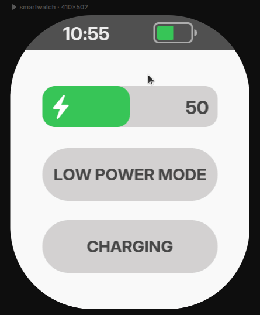
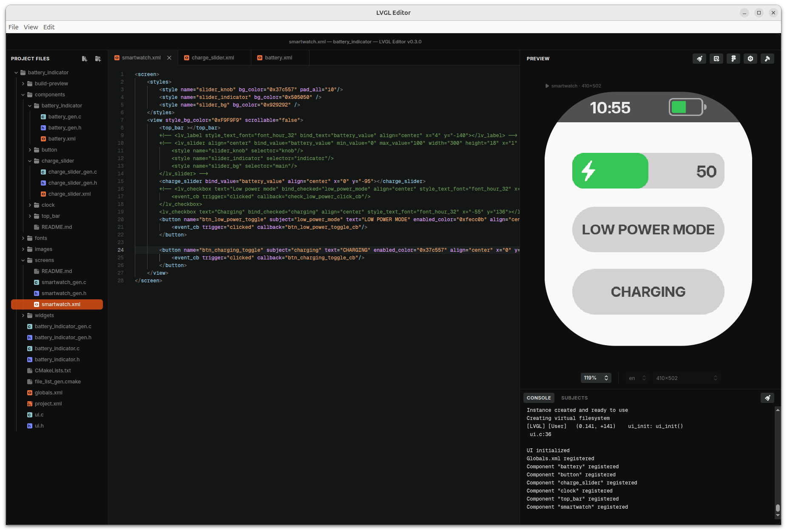
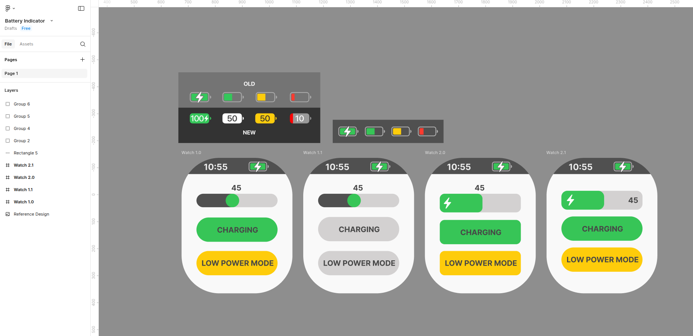
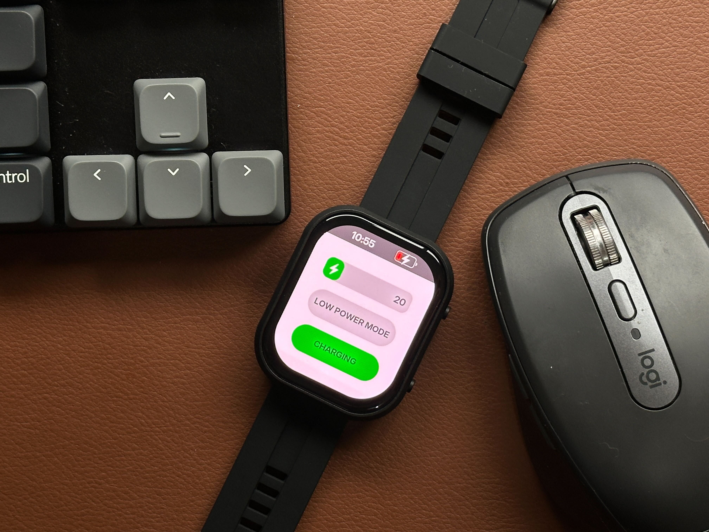

# An iOS inspired battery indicator made in LVGL's UI Editor

This project is a battery indicator component example to be used in LVGL's UI Editor. It explores binding of subjects and styles in XML. 

Download this repo and open the `battery_indicator` folder in the Editor.

You can also see it live in the online preview: [Battery Indicator Online Live Preview](https://viewer.lvgl.io/?repo=giobauermeister/battery-indicator-lvgl-editor/tree/main/battery_indicator)

Figma design. Access [here](https://www.figma.com/design/HVvM9m0egZy0wYZDLKKPTA/Battery-Indicator).

Tested in a real hardware. Waveshare smartwatch: [https://www.waveshare.com/esp32-s3-touch-amoled-2.06.htm](https://www.waveshare.com/esp32-s3-touch-amoled-2.06.htm)

Please visit [https://lvgl.io/editor](https://lvgl.io/editor) for more information.

